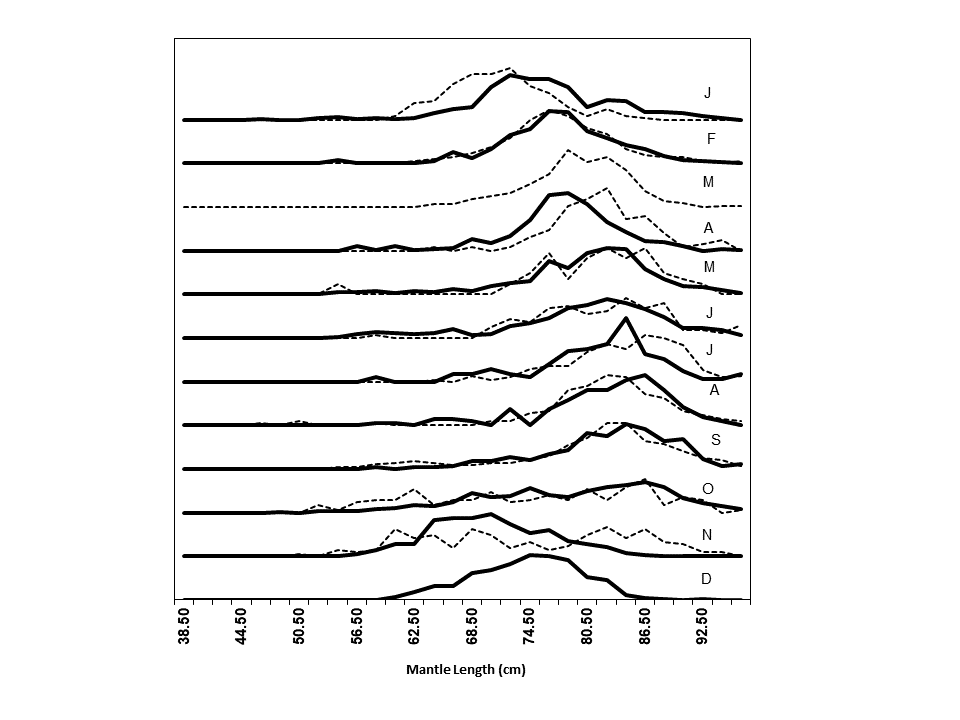

```{r setup, include=FALSE}
knitr::opts_chunk$set(echo = FALSE)

```
#####
# SUMMARY
***
@Paya2019 wrote version 1.0 of the SQUIDSIM, a program to simulate individual, population, and fishery components of Humboldt Squid stock in month scale. Two growth functions (exponential or VonBertalanffy) were included.  Maturity was modeled as a logistic function. Two options for modeling stock-recruitment relationship (Ricker or Beverton and Holt) with steepness parameters and process errors were included. Three options (constant, exponential and sinusoidal) for seasonal recruitment patterns were allowed. The fishing component includes two fleets with selectivity patterns modeled as double half-normal functions. A length-age key is calculated based on the growth model in order to estimate the mantle length frequency in the population and in the commercial catches. 
This simulator was coded in R Mardown in R Studio, which allows to automatically knit text, R codes, tables and figures to produce a report in html, word, and pdf formats. In order to run the simulation with different cases, the parameters must be input in a csv format file.

The version 1.1, added to the simulation: two CPUE indices (with hyperstability); two acoustic biomasses indices. The selectivity curves of the acoustic surveys were modeled by length using double half-normal functions. Also, added a new option for seasonal recruitment pattern, new charts and improvements to some others charts.

The current version 1.2, adds 1) the longevity and the fecundity parameters to estimate the natural mortality using gnomonic method @Caddy1996, 1) a third commercial fishery.

# INTRODUCCTION
***
The Scientific Committee seems to agree that because of the short lifetime (1 -2 year) of Humboldt squid, the stock assessment and management should be done in-season scale. However, the impact of not doing so and try to apply models with year scale, as the global production models, has not been formally evaluated.

Management strategy evaluation requires to build an operational model to test different stock assessment models and harvesting rules. The simulation of the stock dynamics and the fisheries is the first step in development an operational model. Therefore, this contribution offers a simulator of the population dynamic and fishery of Humboldt squid stock.

From the point of view of the local squid stock assessment in the EEZ of Chile, the simulator should be able to reproduce the mantle length frequencies observed by month in artisanal catches in 2015 (broken line) and 2016 (solid line)[@Paya2015; @Paya2016].  


These frequencies had a clear modal progression that suggests the arrival of large squids in November and the departure in October of the next year [@Paya2016]. This mantle length data combined with abundance indices have been used in fitting successfully local depletion models [@Paya2015; @Paya2016; @Paya2017; @Paya2019].

The version 1.0 was design to simulate the dynamic of Humboldt Squid population in Chilean waters. The time scale is month. The recruitments are modelled using a @Ricker1954 or a @BevHolt stock-recruitment relationship, with a steepness parameter (h) [@MaceDoonan1988] and process errors (rsigma). Recruitment can also be multiply by a seasonal factor to generate a seasonal pattern. Seasonal pattern can be constant (no effect), exponential decreasing or sinusoidal. The fishing component includes two fleets. The fishing selectivities are modelled using double half-normal functions.

The version 1.1 extended the squid simulator to the FAO area 87. It added four abundance indices: two CPUE indices (with or without hyperstability) and two acoustic biomasses. Selectivity curves of the acoustic surveys were modelled by length using double half-normal functions. Also, adds a new option for seasonal recruitment pattern, new charts and improvements to some others charts.

The current version 1.2, adds 1) the longevity and the fecundity parameters to estimate the natural mortality using gnomonic method @Caddy1996, 1) a third commercial fishery.

This simulator is coded in R Mardown in R Studio [@Markdown]. The individual, population and fishery parameters are setting in a file named "HSquid_Par.csv". The use of external parameter file allows to run the simulation with different set of parameters. 

#####
# METHODS
***
The age and time variables are in units of years and they are divided by month. The $bin$ is the fraction of the year for a month ($bin=1/12$). The age $i$, $i=1,...,nags$, where $nags$ is numbers of months in the lifetime. The time $j$, $j=1,.....nbtins$, where $nbtins$ is the whole numbers of months in the time series. 

## INDIVIDUAL FUNCTIONS

### Growth models
There are two model options.
If gm=1 the exponential model is used:
$$ l_{i} = a_{expo}exp(b_{expo}t)$$
where $l$ is the Mantle length (cm) and $a_{expo}$ and $b_{expo}$ are the parameters, which were taken from @Argüellesetal2001 for large squid with hatching in spring.

If gm>1 the vonBertalanffy model is used:
$$ l_{i} = loo(1-exp{(-r(t-t_{0}))}$$
where $loo$: Infinite length (cm); $r$: growth rate; $t$: age in years; $t0$: age in years at length zero;

### Allometric growth
$$ w_{i}= al_{i} ^{b }$$
where $a$ and $b$ are the allometric parameters and $w$ is the whole weight.

The vonBertalanffy parameters and the allometric parameters were taken from @Payaetal2014.

### Maturity
$$ pm_{i} = 1/(1 + exp{(-log(19)(l_{i}-lm50)/lmrange)) }$$
where $lm50$ is the length at 50% of maturity and $lmrange$ is the amplitude of the function.

## POPULATION FUNCTIONS
### Natural Mortality (M)
M is estimated using the gnomonic method @Caddy1996 and the R package gnomonicM of @Torrejon-Magallanes2021. Following to @Martínez-Aguilaretal2010, the number of gnomonic intervals is fixed to 5 and the duration of the first interval (egg) is fixed to 6 days, while longevity and fecundity are input parameters. M is equal to adult mortality.

$$M_{i,j}=M_{bin} + e^{M}_{i,j}$$
where $e^{M} \sim N(0,sd_{M})$ and $sd_M$ is the standard deviation of $Mbin$

### N at the first month

The recruitment before the first year is a vector of length equals to numbers of ages -1 (nags-1)
$$ predR_{i}=R0 \quad exp(e^{0}_{i}) $$
$$e^{0}_{i} \sim N(0,prevrsigma)$$

where $prevrsigma$ is the standard deviation of recruitments before the starting month.

The number at age 1 at the first month is R1
$$N_{1,1}=R1$$
and for the older ages (i>2) is the number of survivors of previous recruitments
$$N_{i,1} = predR_{nags-1-i} \quad exp(-M_{i-1,1}(i-1)) \quad exp({e^{0}_{i}})$$

### Seasonal Recruitment Patterns

Constant pattern ($RSeason$=1):
$$ inbinR=1 \quad  exp(e^{s}_{1})$$ 
Exponential pattern ($RSeason$=2), with $inbinR_{1}=1$:
$$ inbinR_{i}=exp(-0.20(i-1))\quad  exp(e^{s}_{i}) \quad \quad for \quad i=2,...,12$$
Sinusoidal Pattern, two peaks in a year ($RSeason$=3):
$$inbinR_{i}= \sin(3+i) \quad  exp(e^{s}_{i}) \quad \quad for \quad i=1,...,12$$
Sinusoidal Pattern, one peak in a year ($RSeason$=4):
$$inbinR_{i}= \sin(9+i/2) \quad  exp(e^{s}_{i}) \quad \quad for \quad i=1,...,12$$
$$e^{s} \sim N(0,SdSeason)$$
Non negative $inbinR_{i}$ were not allowed, so if $inbinR_{i}$<0 then $inbinR_{i}$=0.  

### Figure 1. Seasonal recruitment pattern options.
```{r}
par(mfcol=c(2,2))
plot(1:12,rep(1,12),ylim=c(0,1),t="l",xlab="Month",ylab="Option 1")
plot(1:12,c(1,exp(-0.2*(1:11))),ylim=c(0,1),t="l",xlab="Month",ylab="Option 2")
plot(1:12,sin(3+c(1:12)),ylim=c(0,1),t="l",xlab="Month",ylab="Option 3")
plot(1:12,sin(9+c(1:12)/2),ylim=c(0,1),t="l",xlab="Month",ylab="Option 4")
```

### Equilibrium functions

The numbers per recruit ($Neq_{1}=1$), are :
$$Neq_{i} = Neq_{i-1}exp(-M_{i-1,1}) \quad  \quad for \quad i=2,...,nags$$
The potential spawning biomass per recruit, $SPBR$, in tons:
$$SBPR=\sum_{i=1}^{nags} w_{i}pm_{i}Neq_{i}/1000$$
For $SB0$ (in tons) $R0$ is:
$$R0=SB0/SBPR$$
There are two options for the stock-recruitment model. If parameter SRModel= 1 then Ricker else Beverton-Holt.

The Ricker parameters are calculated based on the steepness parameter $h$ are:
$$alpha=1.25log(5*h)-log(SBPR)$$
$$beta=1.25log(5h)/SB0$$
The Beverton-Holt parameters based on steepness parameter $h$ are:

$$alpha=(1-h)/(4h) \quad SBPR$$
$$beta=(5h-1)/(4h \quad SB0) \quad SBPR$$
The recruitment at the first month $j$=1, using Ricker model is calculated as:
$$R_{1}=N_{1,1}= SB0 exp(alpha-beta*SB0) \quad inbinR_{j} \quad exp(e^{r}_{j}-rsigma^2/2) $$
while with Beverton-Holt model as: 
$$R_{1}=N_{1,1}=SB0/ (alpha+betaSB0) \quad inbinR_{j} \quad exp(e^{r}_{j}-rsigma^2/2) $$
where $e^{r}_{j}$ is:
$$e^{r}_{j}\sim N(0,rsigma)$$

### Population after the first month (j>1)
The number $N_{i,j}$ are: 

$$N_{i,j}=N_{i-1,j-1}exp(-M_{i,j}-F_{i,j})$$
The whole number by month, $NT$(tons), is:
$$NT_{j}=\sum_{i=1}^{nags} N_{i,j}$$
The whole biomass by month, $BT$(tons), is:
$$BT_{j}=\sum_{i=1}^{nags} N_{i,j}w_{i}/1000$$
The whole spawning biomass, $SBT$(tons), is:
$$SBT_{j}=\sum_{i=1}^{nags} N_{i,j} mat_{i}w_{i}/1000$$
where, $mat_{i}$ is the maturity at age.


The recruitment, $R_{j}$, with Ricker model is:

$$R_{j}=N_{1,j}= SBT_{j-1} exp(alpha-betaSBT_{j-1}) \quad inbinR_{j} \quad exp(e^{r}_{j}-rsigma^2/2) $$
while with Beverton-Holt is:
$$R_{j}=N_{1,j}=SBT_{j-1}/ (alpha+betaSBT_{j-1}) \quad inbinR_{j} \quad exp(e^{r}_{j}-rsigma^2/2) $$

To estimate the length frequency an age-length key,$alkey$ , is calculated assuming a normal distribution of length at age:

$$alkey_{i,j}= \frac{1}{{\sigma_{i} \sqrt {2\pi } }}e^{-(ls_{j}-l_{i})^2/2\sigma_{i}^2}\quad for \quad i=1,...,nags; \quad j=1,...,nls$$
where $ls_{i}$ is the mean length at age and $\sigma_{i}$ is the standardt deviation at age. $\sigma_{i}$ = $ls_{i}$*$CVGrowth$ 

The number at length ($k$) and month ($j$), $N_{k,j}$, is calculated as:

$$N_{k,j}=\sum_{i=1}^{nags} (N_{i,j} \quad * \quad alkey_{k,i})$$

## FISHERY FUNCTIONS
### Selectivity and Fishing mortality.
Selectivity, $S$, are modelled by fleet ($f$) using double half-normal functions:
$$S^f_{i}= exp(-0.5(i-bs^f)^2)/{as^f}^2) \quad \quad for \quad i<sb^f.$$
$$S^f_{i}= exp(-0.5(i-bs^f)^2)/{cs^f}^2) \quad \quad for \quad i=>sb^f.$$
where $as, bs$ and $cs$ are parameters. $bs$ is the age of maximun selectivity ($S^f_{bs}=1$)

The fishing mortality,$F$, by fleet ($f$) at age and month is calculated as:
$$ F^f_{i,j}=F^f_{ref}bin \quad S^f_{i}$$
The whole fishing mortality is:
$$ F_{i,j}=\sum F^f_{i,j}$$

### Catch
Catch, $C$, by fleet ($f$) in numbers at age ($i$) and month ($j$):
$$ C^f_{i,j} =F^f_{i,j}/(F_{i,j}+M_{i,j})N_{i,j}(1-exp(-M_{i,j}-F_{i,j}))$$
Catch in number by fleet ($f$) at length ($k$) and month ($j$) is calculated as:
$$C^f_{k,j}=\sum_{i=1}^{nags} (C^f_{i,j} \quad * \quad alkey_{k,i})$$
The whole catches in numbers are:
$$ C_{i,j}=\sum C^f_{i,j} \quad \quad ; \quad C_{k,j}=\sum C^f_{k,j}   $$
The catch (tons) by fleet, $YT^f$(tons), is:
$$YT^f_{j}=\sum_{i=1}^{nags} C^f_{i,j}w_{i}/1000$$
The whole catch (tons) is:
$$ YT_{i,j}=\sum YT^f_{i,j}$$

## ABUNDANCE INDICES
### CPUE
$CPUE$ by fleet ($f$) and month ($j$) is:
$$CPUE^f_{j}=q^f(\sum_{i=1}^{nags} (C^f_{i,j}w_{i}/1000)/F^f_{i,j})^{hyp}$$

### Acoustic Selectivity.
Acoustic selectivity ($S$) by length ($l$) are modelled by survey ($f$) using double half-normal functions:
$$S^f_{l}= exp(-0.5(l-bs^f)^2)/{as^f}^2) \quad \quad for \quad l<sb^f.$$
$$S^f_{l}= exp(-0.5(l-bs^f)^2)/{cs^f}^2) \quad \quad for \quad l=>sb^f.$$
where $as, bs$ and $cs$ are parameters. $bs$ is the length at the maximun selectivity ($S^f_{bs}=1$)

### Acoustic Biomass
Acoustic Biomass ($Bacous$) by survey ($f$) and month ($j$) is:
$$Bacous^f_{j}=qacous^f_{j}\sum_{i=1}^{nls}S^f_{l,j} N_{l,j}w_{l}/1000$$


#####
# RESULTS
***
The results are presented in graphs and then the parameters in tables.

## INDIVIDUAL FUNCTIONS

```{r message=FALSE, warning=FALSE, paged.print=FALSE,message=FALSE}
### Limpia variables
##rm(list = ls())
# Read External Parametrer input file
#input.prs=read.table("HSquid_Par.csv",sep=",",header=TRUE,skip=1)
input=read.table("HSquid_Par.csv",sep=";")
prs=t(as.vector(input$V3))
colnames(prs)<-input$V2
input.prs<-data.frame(prs)
attach(input.prs)

# Internal Parameters
bin=1/12
months=1:12
ls=seq(1:110)
ags=seq(bin,Longv,bin)
yrs=seq(Fyear,Lyear)
tbins=seq(Fyear,Lyear,bin)
nls=length(ls)
nags=length(ags)
nyrs=length(yrs)
ntbins=length(tbins)

# Parameter for short print of simualtions 1=Yes; other long print
printbins=1:ntbins
shortprint=1
if (shortprint==1) printbins=c(1:12,61:72,121:132,229:240)


## Growth
w=l=vector()
for (i in 1:nags){
if(gm==1){
# large springArguelles et al 2001. Fisheries Research 54.    
#a_expo=309.11
#b_expo=0.0029
   l[i] = a_expo *exp(b_expo*ags[i]*365)/10
ind.pars<-rbind(a_expo,b_expo,a,b)   
}else{
 # Paya
 #loo=83.94;r=0.93;t0=0.0
 #a=0.000023067;b=3.077
  l[i]=loo*(1-exp(-r*(ags[i]-t0)))
ind.pars<-rbind(loo,r,t0,a,b)  
}
w[i]=a*l[i]^b
}
```

### Figure 2. Growth at size and age.
```{r}
par(mfrow=c(2,1),mar=c(4,4,1,1))
plot(ags,l,t="l",ylim=c(0,max(l)),xlab="Age",ylab="ML (cm)")
plot(ags,w,t="l",ylim=c(0,max(w)),xlab="Age",ylab="weight (kg)")
```

### Figure 3. Maturity at size and age.
```{r}
# Maturity at length
pm=ls/ls
ind.pars<-rbind(ind.pars,lm50,lmrange)
for (i in 1:nls){
pm[i]= 1 / (1 + exp(-log(19)*(ls[i]-lm50)/lmrange) )
}
# Maturity at age
pm_age=vector()
for (i in 1:nags){
pm_age[i] = 1 / (1 + exp(-log(19)*(l[i]-lm50)/lmrange) )}

par(mfrow=c(2,1),mar=c(4,4,1,1))
plot(ls,pm,t="l", ylim=c(0,1),xlab="ML (cm)",ylab="Maturity proportion")
plot(ags,pm_age ,t="l", ylim=c(0,1),xlab="Age",ylab="Maturity proportion")
```
<br>
    
### Table 1. Individual Parameters
<br>
```{r}
library(knitr)
if(gm==1){growth.pars<-data.frame(a_expo,b_expo,a,b)
} else {growth.pars<-data.frame(loo,r,t0,a,b)}
mat.pars<-data.frame(lm50,lmrange)
knitr::kable(growth.pars, caption= 'Growth Parameters') 
```
<br>
```{r}
knitr::kable(mat.pars, caption= 'Maturity Parameters') 
#knitr::kable(t(ind.pars)) 
```
<br>

#####
## POPULATION FUNCTIONS
```{r}
## Natural mortality
# gnomonicM
#install.packages("gnomonicM")
library("gnomonicM")
#365
#Egg	6
#Paralarva	11
#Juvenile	30
#Subadult	84
#Adult	234
#Fecundidadad  192410148
#Fecundities=c(813000, 16387656,25887000)
#Longevities=c(365,365,365*2)
GM<- gnomonic(nInterval   = 5, 
                         eggDuration = 6, 
                         #addInfo     = c(12,38, 118, 365),
                         longevity   = Longv*365, 
                         fecundity   = Fec, 
                         a_init      = 2)
M_Annual=GM$results$M_year[5]
M_bin=M_Annual*bin
SdM=M_bin*M_cv

SB=B=N=M=matrix(NA,nags,ntbins)
for (i in 1:nags) M[i,]=M_bin+rnorm(ntbins)*SdM
#  Reclutas
# In-bin recruitment pattern
inbinR=vector("numeric",ntbins)
inbinR[1]=1

# select type of recruitment pattern
# 1 =  Constant
# 2 = Exponential decreasing 
# >2 = Sinuosidal 
# tr=3
if (RSeason==1) {
  R_Seasonal="Constant"
  inbinR=rep(1,ntbins)
} else if (RSeason==2){
  R_Seasonal="Exponential Decreasing"
  for (i in 2:ntbins){
  inbinR[i]=inbinR[i-1]*exp(-0.20)
  for( j in 1:nyrs){
  if(tbins[i-1]==yrs[j]) inbinR[i]=1
  }
  }
} else if (RSeason==3) {
  R_Seasonal="Sinusoidal with two peaks"
  patron=sin(4:15)
  patron[which(patron<0)]=0
  patron0=patron
  for(j in 1:nyrs-1){
  patron0=c(patron0,patron)
  }
  inbinR=patron0[1:ntbins]
} else {
  R_Seasonal="Sinusoidal with one peak"
  patron=sin(9+(1:12)/2)
  patron[which(patron<0)]=0
  patron0=patron
  for(j in 1:nyrs-1){
  patron0=c(patron0,patron)
  }
  inbinR=patron0[1:ntbins]  
}

# add error to inbinR
# Recruitment
#R_sd=0.00000
#inbinR=inbinR * rnorm(length(inbinR), 1, SdSeason)
#plot(inbinR,typ="p")
# recruitment correlation
#corre=1
#cv=0.3
#AR=vector(ntbins/12)
#AR[1,i]=N[1,i-1]*(corre + rnorm(1)*CVSeaon*CorrSeason)
```

### Figure 4. M by age and YEAR.MONTH (if M is constant then one color).
```{r message=FALSE}
image(tbins,ags,t(M),xlab="Year_Month",ylab="Ages (year)")
```

### Figure 5. Recruitment before the starting time.
```{r}
# R0
Neq=rep(1,nags)
for (i in 2:nags){
Neq[i] = Neq[i-1]*exp(-M[i-1,1])}
SBPR=sum(w*pm_age*Neq)/1000  # tons
R0=SB0/SBPR
# Stock-Recruitment Model
if(SRModel==1){
# Ricker
alpha=1.25*log(5*h)-log(SBPR)
beta=1.25*log(5*h)/SB0
} else {  
# B-H Model
alpha=((1-h)/(4*h))*SBPR
beta=(5*h-1)/(4*h*SB0)*SBPR
}

# Initial N (at the first year)
SB=N=matrix(1:nags*ntbins,nags,ntbins)
# Previuos recruitment
preR=rep(R0,nags)*exp(rnorm(nags,0,prev.rsigma)-prev.rsigma^2/2)*inbinR[nags:1]
plot(ags,preR,t="l",xlab="Age (Years) ",ylab="Previous  Recrutiment")
```

### Figure 6. N at the first year.
```{r}
N[1,1]=preR[nags]
for (i in 2:nags)
  { N[i,1] =preR[nags-i+1]*exp(-M[i-1,1]*(i-1))}
plot(N[,1],xlab=" Age (Months)",ylab=" N",ylim=c(0,max(N[,1])),t="l")
```

### Figure 7. Seasonal recruitment patterns.
```{r}
plot(1:12,inbinR[1:12],type="l",xlab="Month",ylab="Recruitment pattern")
```

### Figure 8. Fishing Selectivity by fleet.
```{r}
## Funcion Selectividad 
Selectividad=function(a,b,c,edades,nedades){
Se=rep(0,nedades)
for (i in 1:nedades){
if( edades[i]<b){
Se[i]= exp(-0.5*((edades[i]-b)^2)/a^2)
} else {
Se[i]= exp(-0.5*((edades[i]-b)^2)/c^2)  
}
}
Se
}
#### Fishery Selectivities
S=S1=S2=S3=rep(0,nags)
S1=Selectividad(as1,bs1,cs1,ags,nags)
S2=Selectividad(as2,bs2,cs2,ags,nags)
S3=Selectividad(as3,bs3,cs3,ags,nags)
#### Acoustic Selectivity at length
S4=Selectividad(as4,bs4,cs4,ls,nls)
S5=Selectividad(as5,bs5,cs5,ls,nls)

# Fishing Mortality
C=C1=C2=C3=F=F1=F2=matrix(0,nags,ntbins)
ones=rep(1,ntbins)
F1=S1%*%t(ones)*Fref1*bin
F2=S2%*%t(ones)*Fref2*bin
F3=S3%*%t(ones)*Fref3*bin
F=F1+F2+F3
S=(F1[,1]+F2[,1]+F3[,1])/max((F1[,1]+F2[,1]+F3[,1]))
plot(ags,S1,t="l",col=2,ylab="Selectivity",xlab="Age (year)")
lines(ags,S2,t="l",col=3,lty=2,lwd=2)
lines(ags,S3,t="l",col=4,lty=2,lwd=2)
lines(ags,S,t="l",lty=1,lwd=2,col=1)
text(0.2,.9,"___ Fleet 1",col=2)
text(0.2,.8,"- - - Fleet 2",col=3)
text(0.2,.7,"- - - Fleet 3",col=4)
text(0.2,.6,"- - - Total",col=1)

```

### Figure 9. Spawning Biomass and Recruitment.
```{r}
R=SBT=rep(1,ntbins)
N[1,1]=R[1]=R0
SBT[1]=SB0
#rsigma=0.0
for (j in 1:ntbins){
    if(j>1){
      if(SRModel==1){
      # Ricker
      N[1,j]=R[j] = SBT[j-1]*exp(alpha-beta*SBT[j-1])    
      }else{   
      # Beverton&Holt
      N[1,j]=R[j] = SBT[j-1]/(alpha+beta*SBT[j-1])
      }
   for (i in 2:nags) N[i,j]=N[i-1,j-1]*exp(-M[i-1,j-1]-F[i-1,j-1])
   }
   R[j] =N[1,j]=N[1,j]*exp(rnorm(1,0,rsigma)-rsigma^2/2)*inbinR[j]
   SB[,j]=N[,j]*w/1000*pm_age
   SBT[j]=sum(SB[,j])
   C[,j]=F[,j]/(F[,j]+M[,j])*N[,j]*(1-exp(-M[,j]-F[,j]))
   C1[,j]=F1[,j]/(F[,j]+M[,j])*N[,j]*(1-exp(-M[,j]-F[,j]))
   C2[,j]=F2[,j]/(F[,j]+M[,j])*N[,j]*(1-exp(-M[,j]-F[,j]))
   C3[,j]=F3[,j]/(F[,j]+M[,j])*N[,j]*(1-exp(-M[,j]-F[,j]))
     } 
R_NA=R
R_NA[which(R_NA==0)]=NA
plot(SBT[1:(ntbins-1)],R_NA[2:ntbins],xlab="Spawning Biomass (t-1)",ylab="Recruitment (age1)", ylim=c(0,max(N[1,2:ntbins])),xlim=c(0,max(SBT[1:(ntbins-1)]*1.1)))
```

### Figure 10. Seasonal Pattern of recruitment and Number at the begginning.
```{r}
par(mfrow=c(2,1),mar=c(4,4,1,1))
plot(tbins-10,inbinR,type="l",xlab="Year_Month",ylab="Seasonal pattern",ylim=c(0,max(inbinR) ))
plot(ags,N[,1],typ="l",xlab="Age",ylab="N at first month")
```

### Figure 11. Number at age by YEAR.MONTH.
```{r}
par(mfrow=c(6,1),mar=c(1,2,1,1))
for(j in printbins) {  
barplot(N[,j],names.arg=as.character(1:nags), xlab="",axisnames =TRUE,space=NULL, ylab=NULL)
text(0.9*nags,0.7*max(N[,j]), paste(as.character(floor(tbins[j])),as.character(round((tbins[j]-floor(tbins[j]))*12)+1))) 
#}
}
```

### Figure 12. Whole Catch in number at age by YEAR.MONTH.
```{r}
par(mfrow=c(6,1),mar=c(1,2,1,1))
for(j in printbins) {  
barplot(C[,j],names.arg=as.character(1:nags), xlab="",axisnames =TRUE,space=NULL, ylab=NULL)
text(nags,0.7*max(C[,j]), paste(as.character(floor(tbins[j])),as.character(round((tbins[j]-floor(tbins[j]))*12)+1))) 
#}
}
```

### Figure 13. Fleet 1 Catch in number at age by YEAR.MONTH.
```{r}
par(mfrow=c(6,1),mar=c(1,2,1,1))
for(j in printbins) {  
barplot(C1[,j],names.arg=as.character(1:nags), xlab="",axisnames =TRUE,space=NULL, ylab=NULL)
text(nags,0.7*max(C1[,j]), paste(as.character(floor(tbins[j])),as.character(round((tbins[j]-floor(tbins[j]))*12)+1))) 
#}
}
```

### Figure 14. Fleet 2 Catch in number at age by YEAR.MONTH.
```{r}
par(mfrow=c(6,1),mar=c(1,2,1,1))
for(j in printbins) {  
barplot(C2[,j],names.arg=as.character(1:nags), xlab="",axisnames =TRUE,space=NULL, ylab=NULL)
text(nags,0.7*max(C2[,j]), paste(as.character(floor(tbins[j])),as.character(round((tbins[j]-floor(tbins[j]))*12)+1))) 
#}
}
```

### Figure 15. Fleet 3 Catch in number at age by YEAR.MONTH.
```{r}
par(mfrow=c(6,1),mar=c(1,2,1,1))
for(j in printbins) {  
barplot(C3[,j],names.arg=as.character(1:nags), xlab="",axisnames =TRUE,space=NULL, ylab=NULL)
text(nags,0.7*max(C2[,j]), paste(as.character(floor(tbins[j])),as.character(round((tbins[j]-floor(tbins[j]))*12)+1))) 
#}
}
```

#####
### Figure 16. Length-age key.
```{r}
alkey<-matrix(0,nags,nls)
for(i in 1:nags){
alkey[i,]<-dnorm(ls, mean = l[i], sd = l[i]*CVGrowth)
alkey[i,]/sum(alkey[i,])
}
matplot(t(alkey),t="l",xlab="ML (cm)",ylab="Probability")
```

#####
### Figure 17. Length frequency by YEAR.MONTH.
```{r}
par(mfrow=c(6,1),mar=c(1,1,1,1))
#plot(colSums(N[,20]%*%alkey))
Nl=matrix(0,nls,ntbins)
for(j in seq(1,ntbins)) Nl[,j]<-colSums(N[,j]%*%alkey)
for(j in printbins) {  
barplot(Nl[,j],names.arg=as.character(ls), xlab="",axisnames =TRUE,space=NULL, ylab=NULL)
text(20,0.7*max(Nl[,j]), paste(as.character(floor(tbins[j])),as.character(round((tbins[j]-floor(tbins[j]))*12)+1))) }
```

#####
### Figure 18. Whole Catch in number at length by YEAR.MONTH.
```{r}
par(mfrow=c(6,1),mar=c(1,1,1,1))
#plot(colSums(N[,20]%*%alkey))
Cl=Cl1=Cl2=Cl3=matrix(0,nls,ntbins)
for(j in seq(1,ntbins)) {  
Cl[,j]<-colSums(C[,j]%*%alkey)
Cl1[,j]<-colSums(C1[,j]%*%alkey)
Cl2[,j]<-colSums(C2[,j]%*%alkey)
Cl3[,j]<-colSums(C3[,j]%*%alkey)
}
for(j in printbins) {  
barplot(Cl[,j],names.arg=as.character(ls), xlab="",axisnames =TRUE,space=NULL, ylab=NULL)
text(20,0.7*max(Cl[,j]), paste(as.character(floor(tbins[j])),as.character(round((tbins[j]-floor(tbins[j]))*12)+1))) }
```

#####
### Figure 19. Fleet 1 Catch in number at length by YEAR.MONTH.
```{r}
par(mfrow=c(6,1),mar=c(1,1,1,1))
for(j in printbins) { 
barplot(Cl1[,j],names.arg=as.character(ls), xlab="",axisnames =TRUE,space=NULL, ylab=NULL)
text(20,0.7*max(Cl1[,j]), paste(as.character(floor(tbins[j])),as.character(round((tbins[j]-floor(tbins[j]))*12)+1)))
}
```

#####
### Figure 20. Fleet 2 Catch in number at length by YEAR.MONTH.
```{r}
par(mfrow=c(6,1),mar=c(1,1,1,1))
for(j in printbins) { 
barplot(Cl2[,j],names.arg=as.character(ls), xlab="",axisnames =TRUE,space=NULL, ylab=NULL)
text(20,0.7*max(Cl2[,j]), paste(as.character(floor(tbins[j])),as.character(round((tbins[j]-floor(tbins[j]))*12)+1)))
}
```

#####
### Figure 21. Fleet 3 Catch in number at length by YEAR.MONTH.
```{r}
par(mfrow=c(6,1),mar=c(1,1,1,1))
for(j in printbins) { 
barplot(Cl3[,j],names.arg=as.character(ls), xlab="",axisnames =TRUE,space=NULL, ylab=NULL)
text(20,0.7*max(Cl3[,j]), paste(as.character(floor(tbins[j])),as.character(round((tbins[j]-floor(tbins[j]))*12)+1)))
}
```


### Figure 22. Number at age in the first Year and Recruitment by YEAR.MONTH.
```{r}
par(mfrow=c(2,1),mar=c(4,4,1,1))
plot(ags,N[,1],ylim=c(0,max(N[,1], na.rm = TRUE)),xlab="Age",ylab="N at the first Month",t="l")
plot(tbins,N[1,],ylim=c(min(N[1,], na.rm = TRUE),max(N[1,], na.rm = TRUE)),xlab="Year_Month",ylab="R",t="l")
```

### Figure 23. Whole number by YEAR.MONTH.
```{r}
ones=rep(1,ntbins)
w.m=w%*%t(ones)
#mad.m=pm_age%*%t(ones)
B=N*w.m/1000
Y=C*w.m/1000
Y1=C1*w.m/1000
Y2=C2*w.m/1000
Y3=C3*w.m/1000
# Vulnerable biomass
VB1=VB2=VB3=C*0
VB1=Y1/F1
VB2=Y2/F2
VB3=Y3/F3
#BD=N*w.m*mad.m
NT=colSums(N)
BT=colSums(B)
YT=colSums(Y)
YT1=colSums(Y1)
YT2=colSums(Y2)
YT3=colSums(Y3)
VBT1=colSums(VB1)
VBT2=colSums(VB2)
VBT3=colSums(VB3)
CPUE1=q1*VBT1^hyp1
CPUE2=q2*VBT2^hyp2
CPUE3=q3*VBT3^hyp3
# Acoustic
Nacus1_l=S4%*%t(ones)*Nl
Nacus2_l=S5%*%t(ones)*Nl
wl=a*ls^b
Bacus1_l=wl%*%t(ones)*Nacus1_l/1000
Bacus2_l=wl%*%t(ones)*Nacus2_l/1000
Bacus1=colSums(Bacus1_l)*qacous1/1000
Bacus2=colSums(Bacus2_l)*qacous2/1000
# MPH
MPH=SBT*qMPH

par(mar=c(4,4,1,1))
plot(tbins,NT,typ="l",ylim=c(min(NT),max(NT)),xlab="Year_Month",ylab="Whole Number")
```

### Figure 24. Catch (tons) by YEAR.MONTH.
```{r}
par(mar=c(4,4,1,1))
plot(tbins,YT,typ="l",ylim=c(0,max(YT)),xlab="Year_Month",ylab="Catch (tons)",col=1)
lines(tbins,YT1,typ="l",lty=2,col=2)
lines(tbins,YT2,typ="l",lty=3,col=3)
lines(tbins,YT3,typ="l",lty=3,col=4)
text(2000,10,"Whole",col=1)
text(2005,10,"Fleet 1",col=2)
text(2010,10,"Fleet 2",col=3)
text(2015,10,"Fleet 3",col=4)
```


### Figure 25. Whole number by YEAR.MONTH.
```{r}
#image(ags,tbins,N)
image(tbins,ags,t(N),xlab="Year_Month",ylab="Age (Months)")
```


### Figure 26. Biomass by YEAR.MONTH.

```{r}
plot(tbins,BT,typ="l",ylim=c(min(BT,na.rm=TRUE),max(BT,na.rm=TRUE)),xlab="Year_Month",ylab="Biomass (t)")
```

### Figure 27. Spawning Biomass by YEAR.MONTH.

```{r}
plot(tbins,SBT,typ="l",ylim=c(min(SBT),max(SBT)),xlab="Year_Month",ylab="Spawning Biomass")
```


## ABUNDANCE INDICES

### Figure 28. Hyperstability.
```{r}
par(mar=c(4,4,1,1))
plot(VBT1/max(VBT1),CPUE1/max(CPUE1),typ="l",ylim=c(0,1.1),xlim=c(0,1.1),xlab="Vulnerable Biomass/ Vulnerable Biomass_max",ylab="CPUE/CPUE_max",col=2)
VBT1_teorico=seq(0,1,0.01)
CPUE1_teorico=VBT1_teorico^hyp1
VBT2_teorico=seq(0,1,0.01)
CPUE2_teorico=VBT2_teorico^hyp2
VBT3_teorico=seq(0,1,0.01)
CPUE3_teorico=VBT3_teorico^hyp3
lines(VBT1_teorico,CPUE1_teorico,typ="l",lty=2,col=2)
lines(VBT2_teorico,CPUE2_teorico,typ="l",lty=2,col=3)
lines(VBT3_teorico,CPUE3_teorico,typ="l",lty=2,col=4)
lines(VBT2/max(VBT2),CPUE2/max(CPUE2),typ="l",lty=1,col=3)
lines(c(0,1),c(0,1),typ="l",lty=1,col="black")
text(0.8,0.6,"Fleet 1",col=2)
text(0.8,0.4,"Fleet 2",col=3)
text(0.8,0.2,"Fleet 3",col=4)
```

### Figure 29. CPUE by YEAR.MONTH.
```{r}
Totales=rbind(NT,BT,SBT,YT,YT1,YT2,YT3,CPUE1,CPUE2,CPUE3,Bacus1,Bacus2,MPH)
par(mar=c(4,4,1,1))
par(mfcol=c(3,1))
plot(tbins,Totales[8,],typ="l",ylim=c(min(Totales[8,]),max(Totales[8,])),xlab="Year_Month",ylab="CPUE 1",col=2)
plot(tbins,Totales[9,],typ="l",ylim=c(min(Totales[9,]),max(Totales[9,])),xlab="Year_Month",ylab="CPUE 2",col=3)
plot(tbins,Totales[10,],typ="l",ylim=c(min(Totales[10,]),max(Totales[10,])),xlab="Year_Month",ylab="CPUE 3",col=4)
```

### Figure 30. Examples of CPUE by month and fleet in two different years.

```{r}
aniomes=which(floor(tbins)==2005)
par(mar=c(4,4,1,1))
par(mfcol=c(3,1))
plot(tbins[aniomes],Totales[8,aniomes],typ="l",ylim=c(min(Totales[8,aniomes]),max(Totales[8,aniomes])),xlab="Year_Month",ylab="CPUE 1",col=2)
plot(tbins[aniomes],Totales[9,aniomes],typ="l",ylim=c(min(Totales[9,aniomes]),max(Totales[9,aniomes])),xlab="Year_Month",ylab="CPUE 2",col=2)
plot(tbins[aniomes],Totales[10,aniomes],typ="l",ylim=c(min(Totales[10,aniomes]),max(Totales[10,aniomes])),xlab="Year_Month",ylab="CPUE 3",col=2)

aniomes=which(floor(tbins)==2010)
par(mar=c(4,4,1,1))
plot(tbins[aniomes],Totales[8,aniomes],typ="l",ylim=c(min(Totales[8,aniomes]),max(Totales[8,aniomes])),xlab="Year_Month",ylab="CPUE 1",col=2)
plot(tbins[aniomes],Totales[9,aniomes],typ="l",ylim=c(min(Totales[9,aniomes]),max(Totales[9,aniomes])),xlab="Year_Month",ylab="CPUE 2",col=2)
plot(tbins[aniomes],Totales[10,aniomes],typ="l",ylim=c(min(Totales[10,aniomes]),max(Totales[10,aniomes])),xlab="Year_Month",ylab="CPUE 3",col=2)
```


### Figure 31. Acoustic Biomass by YEAR.MONTH.
```{r}
par(mar=c(4,4,1,1))
par(mfcol=c(2,1))
plot(tbins,Totales[11,],typ="l",ylim=c(min(Totales[11,]),max(Totales[11,])),xlab="Year.Month",ylab="Acoustic Biomass 1",col=2)
plot(tbins,Totales[12,],typ="l",ylim=c(min(Totales[12,]),max(Totales[12,])),xlab="Year.Month",ylab="Acoustic Biomass 2",col=2)
```

### Figure 32. Acoustic Selectivity.
```{r}
plot(ls,S4,t="l",col=2,ylab="Selectivity",xlab="Size",ylim=c(0,1))
lines(ls,S5,t="l",col=3,lty=2,lwd=2)
text(45,.8,"___ Acoustic 1",col=2)
text(45,.3,"- - - Acoustic 2",col=3)
```

### Figure 33. Mean weight by Fleet and YEAR.MONTH.
```{r}
wm_m1=colSums(wl%*%t(ones)*Cl1)/colSums(Cl1)
wm_m2=colSums(wl%*%t(ones)*Cl2)/colSums(Cl2)
wm_m3=colSums(wl%*%t(ones)*Cl3)/colSums(Cl3)
wm_m=cbind(wm_m1,wm_m2,wm_m3)
matplot(tbins,wm_m,t="l",xlab="Year_Month",ylab="Mean weight (kg)",col=c(2,3,4),
        ylim=c(min(wm_m),max(max(wm_m))))
text(tbins[20],0.9*max(max(wm_m)),"___ Fleet 1",col=2)        
text(tbins[20],0.85*max(max(wm_m)),"- - - Fleet 2",col=3)        
text(tbins[20],0.8*max(max(wm_m)),"- - - Fleet 3",col=4)

```

### Figure 34. Mean weight by Acoustic Survey and YEAR.MONTH.
```{r}
wm_m1_acus=colSums(wl%*%t(ones)*Nacus1_l)/colSums(Nacus1_l)
wm_m2_acus=colSums(wl%*%t(ones)*Nacus2_l)/colSums(Nacus2_l)
wm_m_acus=cbind(wm_m1_acus,wm_m2_acus)
plot(tbins,wm_m1_acus,t="l",col=2,ylab="Mean weight (kg)",xlab="Year_Month",
     ylim=c(min(wm_m_acus),max(wm_m_acus)))
lines(tbins,wm_m2_acus,t="l",col=3,lty=2,lwd=2)
text(tbins[20],0.9*max(max(wm_m_acus)),"___ Acoustic 1",col=2)
text(tbins[20],0.8*max(max(wm_m_acus)),"- - - Acoustic 2",col=3)
```

####
### Table 2. Population, Fishery and Indices Parameters.
<br>
```{r}
popu.prs<-data.frame(M_Annual,M_bin,M_cv,SB0,SRModel,h,prev.rsigma,rsigma)
season.prs<-data.frame(RSeason,SdSeason)
#popu.pars
knitr::kable(season.prs, caption = 'Recruitment Seasonal Parameters') 
```
<br>
```{r}

rownames(GM$results)<-list("Egg","Paralarvae","Juvenile","Subadult","Adult")
knitr::kable(round(t(GM$results),1),caption = 'Gnomic M Parameters') 

```

<br>
```{r}

knitr::kable(t(popu.prs),caption = 'M and Stock Recruitment Parameters',digits = 3, format.args = list(scientific = FALSE)) 

```
<br>
```{r}
fish.prs<-data.frame(Fref1,as1,bs1,cs1,Fref2,as2,bs2,cs2,
                     Fref3,as3,bs3,cs3)
#popu.pars
knitr::kable(t(fish.prs), caption = 'Fishery Parameters',digits=4, format.args = list(scientific = FALSE)) 
```

<br>

```{r}
indices.prs<-data.frame(q1,hyp1,q2,hyp2,q3,hyp3,
                        as1,bs1,cs1,as2,bs2,cs2,
                        as3,bs3,cs3,as4,bs4,cs4,
                        as5,bs5,cs5,qacous1,qacous2,qMPH)
#popu.pars
knitr::kable(t(indices.prs), caption = 'Indices Parameters',digits = 4, format.args = list(scientific = FALSE)) 
```
<br>


# REFERENCES